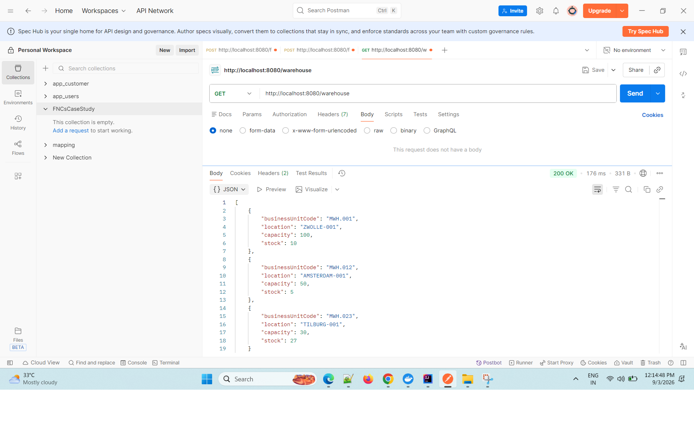
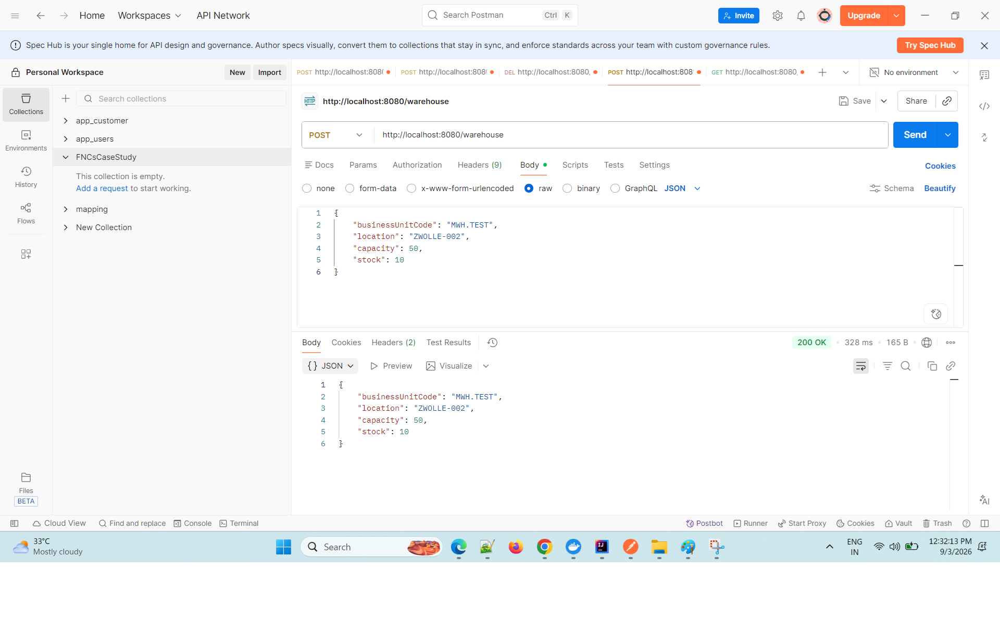
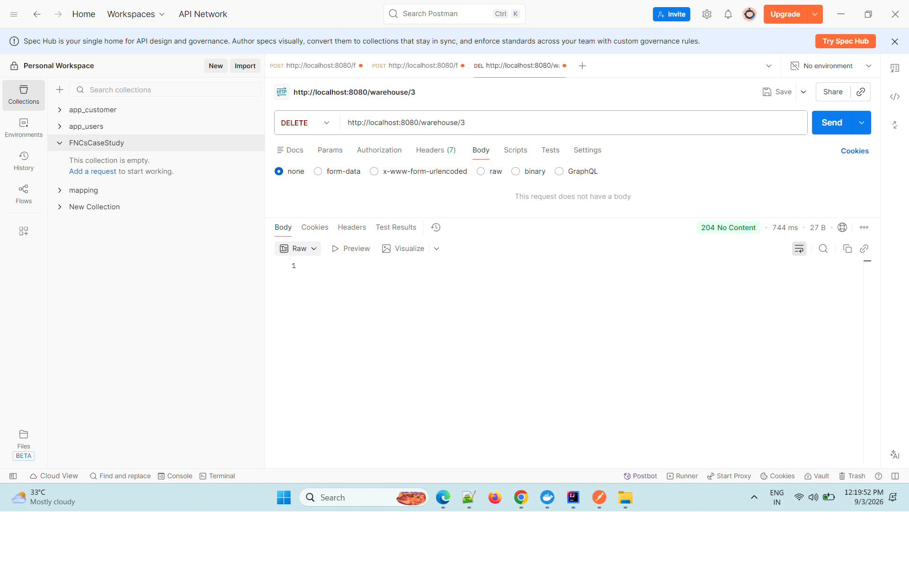
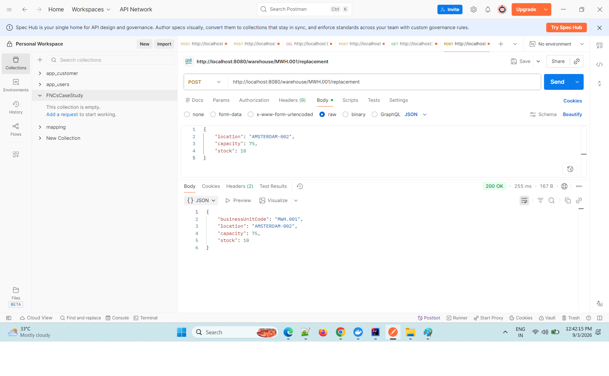
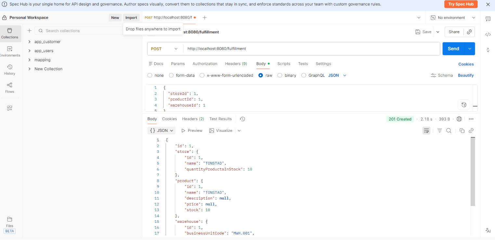
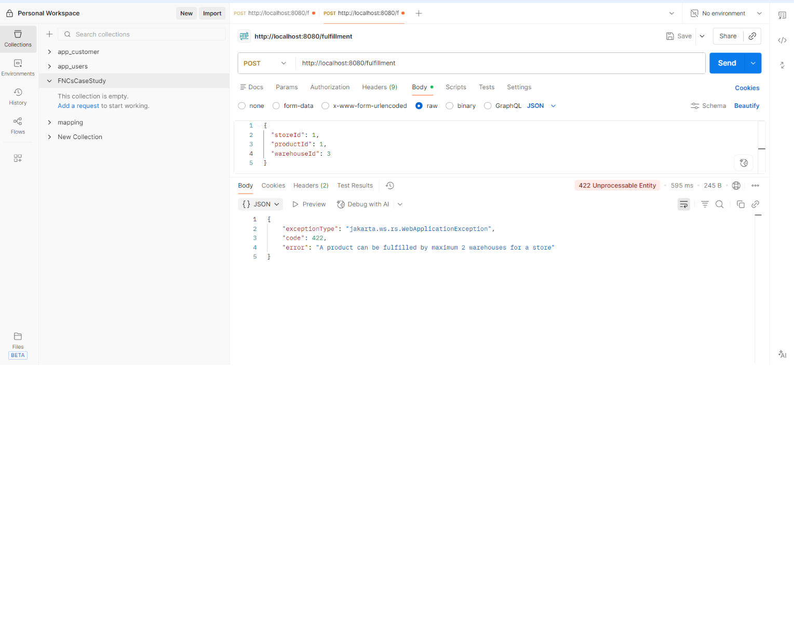

# Java Code Assignment

A Quarkus-based REST API for managing Stores, Products, Warehouses, and Fulfillment relationships.

The application demonstrates:

- REST API implementation
- Business validation rules
- PostgreSQL persistence using Hibernate ORM with Panache
- Hexagonal architecture for the Fulfillment module
- Unit and integration testing
- JaCoCo test coverage
- Exception handling and validation

## Project Architecture

The application follows a layered architecture, with the Fulfillment module structured using a hexagonal approach.

### Fulfillment Module

```text
fulfillment/
├── adapter/
│   ├── in/
│   │   └── FulfillmentResource.java
│   └── out/
│       └── FulfillmentRepository.java
├── application/
│   └── FulfillmentService.java
├── domain/
│   └── model/
│       └── Fulfillment.java
├── port/
│   └── FulfillmentStore.java
├── validator/
│   └── FulfillmentValidator.java
└── FulfillmentRequest.java
```

- **Adapter In** – exposes the REST API endpoint.
- **Application** – contains the fulfillment business/use-case logic.
- **Domain** – contains the Fulfillment domain model.
- **Port** – defines the persistence contract used by the application.
- **Adapter Out** – implements the persistence port using Panache.
- **Validator** – contains fulfillment business validation rules.

## Business Validation Rules

The application enforces the following fulfillment constraints:

- A product can be fulfilled by a maximum of **2 different warehouses** for a store.
- A store can be fulfilled by a maximum of **3 different warehouses**.
- A warehouse can store a maximum of **5 different products**.

When a validation rule is violated, the API returns an appropriate HTTP **422 Unprocessable Entity** response.

## Requirements

- JDK 17+
- Maven
- PostgreSQL database
- Docker (optional, for running PostgreSQL locally)

## Running the Application

Make sure PostgreSQL is available and the database configuration is set in:

```text
src/main/resources/application.properties
```

Start the application in Quarkus development mode:

```sh
mvn quarkus:dev
```

The application will start in development mode with live reload enabled.

The application is available at:

```text
http://localhost:8080
```

## Building the Application

To build the application and run the complete test suite:

```sh
mvn clean verify
```

A successful build indicates that the application compiles and the automated tests pass.

## Running Tests

Run all tests using:

```sh
mvn clean test
```

The test suite covers:

- REST resources
- Repository operations
- Validation logic
- Application behavior
- Fulfillment business rules

## Test Coverage

JaCoCo is used to measure source code test coverage.

Generate the coverage report with:

```sh
mvn clean verify
```

The HTML coverage report is generated under:

```text
target/jacoco-report/index.html
```

To open the coverage report in the default browser on Windows:

```powershell
start target\jacoco-report\index.html
```

Current test coverage:

- **Instruction Coverage: 85%**
- **Branch Coverage: 80%**

The project maintains more than **80% overall source code coverage**.

The JaCoCo HTML coverage report is also uploaded as a GitHub Actions artifact named `jacoco-coverage-report` during CI builds. This allows the generated coverage report to be downloaded and reviewed for each CI run without committing generated `target` files to the repository.

## CI Pipeline

GitHub Actions is configured to automatically build and test the application for pushes and pull requests to the `main` branch.

The CI pipeline performs the following steps:

1. Checks out the source code.
2. Configures JDK 17.
3. Runs the Maven build and complete test suite using:

```sh
mvn clean verify
```

4. Generates the JaCoCo coverage report.
5. Uploads the generated coverage report as the `jacoco-coverage-report` GitHub Actions artifact for tracking.

The workflow configuration is located at:

```text
.github/workflows/ci.yml
```

## Database Configuration

Database configuration is maintained in:

```text
src/main/resources/application.properties
```

The application uses PostgreSQL with Hibernate ORM and Panache for persistence.

## API

The application provides REST APIs for managing Warehouses and Fulfillment relationships.

### Warehouse APIs

#### 1. Get All Warehouses

Use this API to retrieve the available warehouse units.

**Method:** `GET`

**URL:**

```text
http://localhost:8080/warehouse
```

**Request Body:** None

**Example Response:**

```json
[
  {
    "businessUnitCode": "MWH.001",
    "location": "ZWOLLE-001",
    "capacity": 100,
    "stock": 10
  },
  {
    "businessUnitCode": "MWH.012",
    "location": "AMSTERDAM-001",
    "capacity": 50,
    "stock": 5
  },
  {
    "businessUnitCode": "MWH.023",
    "location": "TILBURG-001",
    "capacity": 30,
    "stock": 27
  }
]
```

**Expected Status:** `200 OK`

**Screenshot:** The screenshot below shows the `GET /warehouse` API executed successfully in Postman and the warehouse data returned by the application.



#### 2. Create Warehouse

Use this API to create a new warehouse unit.

**Method:** `POST`

**URL:**

```text
http://localhost:8080/warehouse
```

**Headers:**

```text
Content-Type: application/json
```

**Request Body:**

```json
{
  "businessUnitCode": "MWH.TEST",
  "location": "ZWOLLE-002",
  "capacity": 50,
  "stock": 10
}
```

**Example Response:**

```json
{
  "businessUnitCode": "MWH.TEST",
  "location": "ZWOLLE-002",
  "capacity": 50,
  "stock": 10
}
```

**Expected Status:** `200 OK`

**Screenshot:** The screenshot below demonstrates successful creation of a new warehouse using the `POST /warehouse` endpoint. The request body and `200 OK` response are visible in Postman.



#### 3. Get Warehouse By ID

Use this API to retrieve a specific warehouse using its ID.

**Method:** `GET`

**URL:**

```text
http://localhost:8080/warehouse/1
```

**Request Body:** None

**Example Response:**

```json
{
  "businessUnitCode": "MWH.001",
  "location": "ZWOLLE-001",
  "capacity": 100,
  "stock": 10
}
```

**Expected Status:** `200 OK`

If the warehouse does not exist, the API returns:

```text
404 Not Found
```

#### 4. Archive Warehouse

Use this API to archive an existing warehouse using its ID.

**Method:** `DELETE`

**URL:**

```text
http://localhost:8080/warehouse/3
```

**Request Body:** None

**Example Response:**

```text
204 No Content
```

**Expected Status:** `204 No Content`

**Screenshot:** The screenshot below demonstrates successful warehouse archiving using the `DELETE /warehouse/3` endpoint. The API returns `204 No Content`.



#### 5. Replace Warehouse

Use this API to replace the current warehouse details identified by its business unit code.

**Method:** `POST`

**URL:**

```text
http://localhost:8080/warehouse/MWH.001/replacement
```

**Headers:**

```text
Content-Type: application/json
```

**Request Body:**

```json
{
  "location": "AMSTERDAM-002",
  "capacity": 75,
  "stock": 10
}
```

**Example Response:**

```json
{
  "businessUnitCode": "MWH.001",
  "location": "AMSTERDAM-002",
  "capacity": 75,
  "stock": 10
}
```

**Expected Status:** `200 OK`

**Screenshot:** The screenshot below demonstrates successful replacement of warehouse `MWH.001`. The request changes the location to `AMSTERDAM-002`, capacity to `75`, and stock to `10`, and the API returns `200 OK`.



### Fulfillment APIs

#### 1. Create Fulfillment

Use this API to create a fulfillment relationship between a store, product, and warehouse.

**Method:** `POST`

**URL:**

```text
http://localhost:8080/fulfillment
```

**Headers:**

```text
Content-Type: application/json
```

**Request Body:**

```json
{
  "storeId": 1,
  "productId": 1,
  "warehouseId": 1
}
```

**Expected Status:** `201 Created`

The response contains the created fulfillment together with the associated store, product, and warehouse information.

**Screenshot:** The screenshot below demonstrates successful creation of a fulfillment relationship. The request uses store `1`, product `1`, and warehouse `1`, and the API returns `201 Created` with the created fulfillment details.



#### 2. Fulfillment Validation – Maximum 2 Warehouses per Product

A product can be fulfilled by a maximum of **2 different warehouses** for a store.

For example, after creating fulfillments for the same store and product using warehouses `1` and `2`, attempting to use warehouse `3` will be rejected.

**Method:** `POST`

**URL:**

```text
http://localhost:8080/fulfillment
```

**Headers:**

```text
Content-Type: application/json
```

**Request Body:**

```json
{
  "storeId": 1,
  "productId": 1,
  "warehouseId": 3
}
```

**Expected Response:**

```text
422 Unprocessable Entity
```

```json
{
  "exceptionType": "jakarta.ws.rs.WebApplicationException",
  "code": 422,
  "error": "A product can be fulfilled by maximum 2 warehouses for a store"
}
```

**Screenshot:** The screenshot below demonstrates the fulfillment business validation. After the product has already been associated with two different warehouses for the same store, attempting to use a third warehouse is rejected with `422 Unprocessable Entity`.



#### 3. Fulfillment Validation – Maximum 3 Warehouses per Store

A store can be fulfilled by a maximum of **3 different warehouses**.

The API rejects a new fulfillment when the store already has fulfillments using three different warehouses.

**Method:** `POST`

**URL:**

```text
http://localhost:8080/fulfillment
```

**Headers:**

```text
Content-Type: application/json
```

**Request Body:**

```json
{
  "storeId": 1,
  "productId": 2,
  "warehouseId": 4
}
```

**Expected Response:**

```text
422 Unprocessable Entity
```

```json
{
  "exceptionType": "jakarta.ws.rs.WebApplicationException",
  "code": 422,
  "error": "A store can be fulfilled by maximum 3 different warehouses"
}
```

#### 4. Fulfillment Validation – Maximum 5 Products per Warehouse

A warehouse can store a maximum of **5 different products**.

The API rejects a new fulfillment when the warehouse already contains five different products.

**Method:** `POST`

**URL:**

```text
http://localhost:8080/fulfillment
```

**Headers:**

```text
Content-Type: application/json
```

**Request Body:**

```json
{
  "storeId": 1,
  "productId": 6,
  "warehouseId": 1
}
```

**Expected Response:**

```text
422 Unprocessable Entity
```

```json
{
  "exceptionType": "jakarta.ws.rs.WebApplicationException",
  "code": 422,
  "error": "A warehouse can store maximum 5 different products"
}
```

## API Screenshot Summary

The following screenshots provide evidence of the implemented REST APIs and business validation behavior:

| Screenshot | API | Demonstrates |
|---|---|---|
| `warehouse-create.png` | `POST /warehouse` | Successful warehouse creation with `200 OK` |
| `warehouse-archive.png` | `DELETE /warehouse/3` | Successful warehouse archive with `204 No Content` |
| `warehouse-replace.png` | `POST /warehouse/MWH.001/replacement` | Successful warehouse replacement with `200 OK` |
| `fulfillment-create-success.png` | `POST /fulfillment` | Successful fulfillment creation with `201 Created` |
| `fulfillment-validation-error.png` | `POST /fulfillment` | Business validation failure with `422 Unprocessable Entity` |
| `location.png` | `GET /warehouse` | Successful warehouse retrieval with `200 OK` |

All screenshots were captured using Postman while running the application locally.

## Assignment

The original assignment requirements are available in:

```text
CODE_ASSIGNMENT.md
```